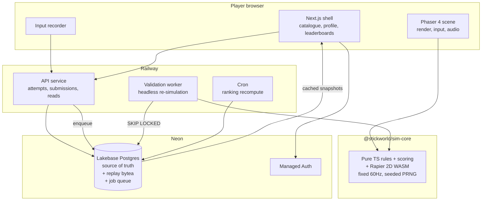

**Implementation Plan — Stickworld Tournament**

**Problem Statement**

Build a browser-based competitive platform hosting ten original single-player stickman physics games, with a verified per-game leaderboard for each and one aggregate championship ranking across all ten. The hard problem is not the games; it is making scores trustworthy. The browser is under the player's control, so a client-reported score is worthless. Everything downstream — per-game ranks, championship points, records, any future prize — depends on the server being able to independently recompute a score from recorded inputs. That requires bit-identical physics in browser and server, which is an unproven assumption in the research and must be settled first.

**Requirements**

Confirmed with you:

- Infrastructure: Neon (Lakebase Postgres, managed Auth) + Railway (Next.js shell, API, validation worker, cron). Two vendors. No Redis at launch.
- Ranked format: fixed courses for the season championship, plus a separate daily-seeded ladder.
- Stakes: bragging rights only at launch. No prizes, no KYC. Live PvP is not in scope but must remain architecturally possible without a rewrite.

Derived from the research and the above:

- Ten single-player games, each producing one integer `ranked_score`, higher always better.
- Every ranked run verified server-side by re-simulation. No trusted client scores, ever.
- Per-game and overall rankings, with overall normalized so unlike score scales contribute equally.
- Season-pinned versions: game, simulation, scoring, and physics build hash.
- Desktop and mobile browsers, touch controls designed in rather than retrofitted.
- All assets original. No third-party game names anywhere in code, UI, repo, or docs.

**Background**

Findings from the research review and my own verification:

Phaser 4.2.1 is GA (verified on npm; 345 KB gzipped full build). The Blueprint's Phaser 4 recommendation is current, and per-game code splitting means a player downloads one game rather than ten.

Rapier's determinism is weaker than two of your documents claim. The docs state Rapier is "locally deterministic... running the exact same simulation twice with the same machine, using the same version" and that "doing this on two different computers may result in completely different results." Cross-platform determinism is conditional, not default. Separately, the documents' stated reason for rejecting JavaScript physics is wrong: JS `+ - * /` and `sqrt` on doubles are IEEE-754 exact and deterministic. The real non-determinism sources are `Math.sin/cos/tan/pow/exp/log` (implementation-defined per ECMAScript and genuinely divergent across V8, JSC and SpiderMonkey), variable timestep, unstable iteration order, and SIMD build variance. The conclusion still favors Rapier, because the same `.wasm` binary bundles its own math and should produce identical results in every runtime — but "should" is doing real work in that sentence, so it gets proven in Task 2 before anything is built on it.

Rapier's docs also flag a trap directly relevant here: using pixels as physics units makes simulations look like slow motion, because a 100×100 px collider is 100 metres wide against gravity of −9.81. Physics runs in SI units with a render scale factor.

Postgres window functions (`rank`, `dense_rank`, `percent_rank`) do the ranking natively, so Redis is an optimization rather than a launch dependency.

The raw `1000 × (1 − percent_rank)` formula that both documents converge on has two defects neither addresses: your points move when other people play and you don't, and a game with 20 entrants awards the same 1,000 points as one with 20,000. The plan below uses a hybrid that fixes both.

**Proposed Solution**

One simulation core, two consumers. Everything else follows from that.

The same `sim-core` package, the same pinned `.wasm`, the same seed, the same inputs — in the browser for play and in the worker for verification. Phaser never touches game rules. If a score cannot be recomputed from inputs, it does not enter a leaderboard.

Ranking has two layers. Per-game: best verified score per player per season, ranked by score descending then published tiebreakers. Overall: each game contributes 0–1,000 points via a hybrid — a fixed placement table for the top 100 (1st = 1000, descending to 900 at 100th) and percentile-scaled 0–899 below that. Stable where the championship is decided, smooth in the tail, and immune to the "my points dropped and I did nothing" problem at the sharp end. A game contributes championship points only once it has 50+ verified entrants; below that it shows as provisional.

**Task Breakdown**

Task 1: Competitive specification, repository foundation, and secrets hygiene

Objective: A private repo that builds clean from a fresh clone, with the competitive rules written down before any code depends on them.

Guidance: Write the Stickworld Competitive Specification first — tick rate, score datatype, replay format, seed format, attempt lifecycle, pause and focus policy, personal-best rules, tie rules, championship point formula, versioning policy. It is short and it prevents ten games from disagreeing. Then scaffold a pnpm workspace monorepo with Turborepo, TypeScript strict mode, ESLint, Prettier, Vitest, and GitHub Actions. Land `.gitignore` covering `Credentials/`, `*.env`, and service-account JSON patterns in the initial commit — `Credentials/project-af3a95dd-….json` looks like a GCP service-account key and must never reach the repo. Move the values into Railway and Neon environment variables.

Tests: CI runs lint, typecheck, and unit tests on every PR. A test asserts that no file matching the credential patterns is tracked by git.

Demo: Clone the private repo fresh, run `pnpm install && pnpm build && pnpm test` green. `git check-ignore -v Credentials/.env` confirms exclusion. The specification is reviewed and merged.

Task 2: Determinism conformance harness — the go/no-go gate

Objective: Prove that one pinned Rapier WASM build produces bit-identical simulation state in Node, Chromium, Firefox and WebKit. Nothing else gets built until this passes or a fallback is chosen.

Guidance: Create `packages/sim-core` with `@dimforge/rapier2d` pinned to an exact version and a non-SIMD build, a fixed 60 Hz stepper, a seeded PRNG (xorshift128+), a deterministic math module that forbids `Math` transcendentals, and a world-state hasher over raw position/rotation/velocity bits. Build a stress fixture exercising the primitives all ten games need: a jointed ragdoll, a rope constraint, a stack of bodies, and a fast projectile with CCD. Run 10,000 ticks. Physics in SI units with an explicit render scale constant. Enforce stable body insertion order.

Tests: A Node test and a Playwright test across all three engines and mobile viewports, each printing a 64-bit state hash and asserting equality against a committed golden value. A negative test that swaps in `Math.sin` and asserts the hash diverges, proving the harness has teeth. An ESLint rule banning `Math.sin|cos|tan|pow|exp|log|random` inside `sim-core`.

Demo: CI output shows four identical hashes from Node, Chromium, Firefox and WebKit. If they differ, this task instead produces a written decision record choosing between fixed-point integer simulation and controlled-runtime verification with provisional scores — which is exactly the outcome you want surfaced in week one rather than month six.

Task 3: Replay format, input recorder, and score event schema

Objective: Record a run compactly, replay it exactly, and prove the round trip.

Guidance: Define input events as `{tick, action, value}`, bit-packed with varint tick deltas then gzipped. Define score events as `{tick, type, points, multiplier}` so a rejected run can be explained rather than just refused. Assert a size budget per game class. Build a `replay:verify` CLI.

Tests: Property test — for random valid input streams, record → encode → decode → replay yields an identical state hash and identical score. Malformed, truncated, and oversized replays are rejected with specific reasons rather than throwing.

Demo: `pnpm replay:verify fixture.swr` prints score, tick count, and a hash match. A 90-second single-button run encodes under 5 KB compressed.

Task 4: Game SDK contract and the permanent conformance game

Objective: One interface every game implements, plus a minimal game that exists forever as the SDK conformance fixture.

Guidance: Define `StickworldGame` with manifest metadata (id, versions, ranked format, max run duration, declared physics budget) and `createSimulation(seed)`, `applyInput`, `step`, `calculateScore`, `isFinished`. Build "Test Chamber" — a deliberately trivial non-shipping game, score equals distance fallen through gates. It is not throwaway: it becomes the permanent CI fixture that every one of the ten games' integrations is checked against.

Tests: Browser and Node both produce the same score for the same seed and input stream. Contract tests that a game declaring a physics budget cannot exceed it at runtime.

Demo: The same game module, driven by the same recorded inputs, prints an identical score in a browser console and in the Node validator.

Task 5: Data model, Neon migrations, and branch-per-PR

Objective: Schema in place, with production-shaped migration testing from day one.

Guidance: Tables: `profiles`, `seasons`, `games`, `game_versions`, `season_games`, `attempts`, `runs` (replay as compressed `bytea`), `score_submissions`, `verified_results`, `game_bests`, `ranking_snapshots`, `verification_jobs`, `audit_events`. Keep attempt, run, and personal best strictly distinct — a player can abandon an attempt, a completed attempt becomes a run, and only a verified run can become a personal best. Use a typed SQL layer (Drizzle or Kysely). Use the pooled PgBouncer connection string from Railway's long-lived processes and note transaction-mode limitations for migrations. Wire CI to create a Neon branch per PR.

Tests: Migrations apply and roll back cleanly on a fresh branch. A seed script creates a season with one game. Constraint tests that a personal best cannot reference an unverified run.

Demo: Open a PR; CI creates a Neon branch, migrates it, runs schema tests, and tears it down. A seeded season is queryable.

Task 6: Authentication, profile, and handle claim

Objective: Sign in, claim a handle, own a profile.

Guidance: Neon managed Auth with Google and Discord OAuth only at launch, avoiding a transactional email vendor. Map an internal user UUID to the provider identity so auth stays loosely coupled. Handle claim with uniqueness, length and charset rules, a reserved-word list, and a confusable-character check. Guests may play practice mode; ranked requires an account.

Tests: Sign-in flow e2e. A second user cannot claim a taken handle. Reserved and confusable handles are refused. Guests are blocked from ranked attempt creation.

Demo: Sign in with Google, claim a handle, view an empty profile. Try the same handle from a second account and get a clear refusal.

Task 7: Attempt issuance API

Objective: The server, not the client, decides what a competitive run is.

Guidance: `POST /v1/games/:gameId/attempts` returns `attempt_id`, seed, `game_version`, expiry, and an HMAC-signed token bound to user and game version. Single-use nonce. Per-user and per-IP rate limits. Fastify or Next route handlers on Railway with schema validation at the boundary.

Tests: A valid request returns a signed attempt. Nonce reuse is rejected. Expired tokens are rejected. Tampered tokens fail signature verification. Rate limits trip and reset.

Demo: `curl` a ranked attempt, then demonstrate each rejection path returning a distinct, non-leaky error.

Task 8: Submission pipeline and full server-side verification

Objective: Every ranked run re-simulated. No exceptions, no tiers.

Guidance: `POST /v1/attempts/:id/finish` accepts inputs plus claimed score. Tier-1 cheap checks first (schema, ownership, expiry, nonce consumption, replay size, input cadence plausibility, duration bounds, score envelope), then enqueue into the Postgres job table. The Railway worker claims jobs with `FOR UPDATE SKIP LOCKED`, loads the exact game version and identical `.wasm`, replays inputs, computes the authoritative score, and accepts or rejects with a reason. A 90-second run is 5,400 headless ticks, so full verification is cheap — and simpler and stronger than the tiered "verify only elite scores" model in the research. Skip the ML anomaly tier entirely; it would be your least reliable component.

Tests: Honest submission verifies. Inflated claimed score is rejected on mismatch. Tampered input stream produces a different recomputed score and is rejected. Duplicate submission for a consumed attempt is rejected. Worker crash mid-job releases the lock and the job retries idempotently.

Demo: Submit an honest Test Chamber run and watch it reach verified. Submit `{"score": 999999999}` and watch it rejected with a recorded reason and audit entry.

Task 9: Per-game leaderboard

Objective: A correct, rebuildable per-game ranking.

Guidance: `game_bests` holds the best verified score per player per `season_game`. Rank with `RANK()` over score descending, then the game's published tiebreakers, then `achieved_at`. Index `(season_game_id, score DESC, achieved_at ASC)`. Serve reads from a materialized snapshot with a short cache. The snapshot must be fully reconstructable from `verified_results`.

Tests: Ordering and tie handling against a known dataset. A better score replaces a personal best; a worse one does not. Drop and rebuild the snapshot and assert byte-identical output.

Demo: Three accounts submit runs; the leaderboard shows correct order, shared places for genuine ties, and a correct "your rank" row. Delete the snapshot, rebuild it, and show identical results.

Task 10: Hookline Sprint — full vertical slice

Objective: One complete game, sign-in to leaderboard, with zero manual database intervention.

Guidance: Simulation first — rope distance constraint, anchor raycasting, gates, perfect-release detection, combo multiplier, fixed course geometry, integer scoring. Then the Phaser 4 presentation layer: rendering, camera, effects, audio hooks, one-button input on keyboard, mouse and touch. Practice and ranked modes. A result screen showing the score breakdown from the score event stream. This becomes the reference implementation every later game copies.

Tests: Determinism fixture for this game. Unit tests for every score event type. A replay fixture for a known high score that the validator reproduces exactly. Full e2e from sign-in through verified leaderboard placement. Touch input test on mobile viewports.

Demo: On a laptop and on a phone: sign in, start a ranked attempt, play, finish, see the run verified, see a personal best recorded, and see your position on the leaderboard.

Task 11: Overall championship ranking

Objective: Aggregate ten unlike score scales into one fair, stable championship.

Guidance: Hybrid points — fixed placement table for the top 100 per game (1000 down to 900), percentile-scaled 0–899 below. A 50-entrant minimum gate before a game contributes championship points; until then, display as provisional. Non-participation scores zero, all ten count. Overall tiebreakers in published order: most game wins, then most top-10 finishes, then highest median normalized result, then earliest achievement of the total. Recompute on a cron schedule, label every standing "as of «timestamp»", and freeze an immutable snapshot at season close. Add an optional secondary "Best 6 of 10" ladder for casual retention.

Tests: A seeded population of ~200 synthetic players across two games validates hybrid point boundaries, gate behaviour, and each tiebreaker. A churn test proves top-100 points are stable when only tail players submit new scores. A season-close test proves the frozen snapshot never changes afterward.

Demo: Championship table with per-game point columns and totals, showing a provisional badge on a game below the entrant gate, and an "as of" timestamp that advances on recompute.

Task 12: Extract shared packages from proven code

Objective: Stop, extract what Hookline actually proved, and only that.

Guidance: `@stickworld/physics-kit` (rope joint, hinge, wheel assembly, moving platform, breakable object, projectile, checkpoint, impact sensor), `@stickworld/ragdoll` (the standard ten-body stickman: head, torso, two upper arms, two forearms, two upper legs, two lower legs), `@stickworld/input`, `@stickworld/scoring` (combo, multiplier, streak), `@stickworld/ui`, `@stickworld/telemetry`. Resist extracting anything speculative — premature abstraction here costs more than duplication.

Tests: After refactoring Hookline onto the shared packages, its determinism hash and its replay fixture score must be byte-identical to before. Bundle size measured and recorded as a budget.

Demo: Hookline runs on shared packages with an unchanged golden hash and unchanged fixture score, and a recorded bundle size baseline.

Task 13: Daily seeded ladder

Objective: The second ranked format, without destabilising the championship.

Guidance: Server-issued daily seed per game, its own leaderboard tables and snapshots, a per-day attempt cap, and archival of yesterday's board. Championship leaderboards stay on fixed courses and are untouched by daily results.

Tests: Seed rotation at the UTC boundary. Attempt cap enforced and reset. Yesterday's board archived immutably. A daily submission provably does not alter championship standings.

Demo: Play the daily ladder, hit the attempt cap, cross the UTC boundary and see a fresh seed with yesterday archived.

Task 14: Game production template and Pickaxe Ascent

Objective: Codify the repeatable per-game process and prove it on game two.

Guidance: Write the game integration checklist — design spec, frozen score contract, seed fixtures, determinism test, scoring unit tests, replay fixture, e2e test, touch controls, performance budget, declared physics budget, accessibility pass. Build Pickaxe Ascent using only the SDK and shared packages, touching no platform code.

Tests: The identical suite Hookline passes, with no game-specific platform changes required.

Demo: Game two live on the platform with its own leaderboard and championship column, plus a recorded integration time to compare against Hookline's build time.

Task 15: Wave A — projectile games (Launch Lab, Ragdoll Archery Rush, Hammer Throw Havoc)

Objective: Three games on the shared projectile and angular-velocity systems.

Guidance: Each repeats the Task 14 pattern. Launch Lab and Hammer Throw use best-of-three attempts bundled into a single submission and a single replay — never three separate submissions, which triples verification load and lets players cherry-pick. Extend `physics-kit` only where two of the three genuinely need the same thing.

Tests: Per-game full suite. Multi-attempt scoring aggregation unit tests. Replay size assertions confirming these remain the smallest payloads on the platform.

Demo: Five games live, five leaderboards, championship table with five populated columns.

Task 16: Wave B — Pogo Tower

Objective: Angular momentum and precision landing on the weekly-seeded format.

Guidance: Reuse joint and moving-platform primitives. This is the first game where the seeded generator drives level content, so the generator itself must be deterministic and versioned.

Tests: Same seed produces identical geometry across all four runtimes. Full per-game suite.

Demo: Six games live; two players given the same seed see identical towers.

Task 17: Wave C — continuous movement (Rooftop Relay, Balance Bike Blitz, Cargo Chaos)

Objective: The longest runs, the largest replays, and vehicle physics.

Guidance: Rooftop Relay uses a kinematic character controller rather than a dynamic body — more deterministic and cheaper. Balance Bike Blitz uses the wheel assembly with suspension springs. Cargo Chaos uses jointed cargo with a condition metric. These have the largest replays on the platform, so validate against the size budget early rather than at the end.

Tests: Per-game full suite plus explicit replay-size and frame-time assertions on mid-range mobile.

Demo: Nine games live; the platform still meets load-time and frame-time budgets on a real mid-range Android device.

Task 18: Wave D — Demolition Dive

Objective: The spectacle game, last, with hard limits.

Guidance: Highest determinism risk, largest simulation state, worst mobile profile. Enforce hard caps on active rigid bodies, destructible objects, and chain-reaction depth, declared in the manifest and asserted at runtime. Best-of-three launches in one attempt. Debris that leaves the play area despawns deterministically.

Tests: Body-cap enforcement test. Determinism fixture at maximum body count across all four runtimes. Mobile frame-time test at worst case.

Demo: All ten games live, each with a leaderboard, and a fully populated ten-column championship table.

Task 19: Asset pipeline — Gemini and Deepgram at build time

Objective: Generated art and voice as static build output, never a runtime dependency.

Guidance: A build script that generates 2D art via Gemini (backgrounds, UI, badges, textures, stickman skins) and announcer voice lines via the Deepgram CLI (countdowns, personal-best celebrations, tutorial narration), writing static files. Never call either API at runtime — cost, latency, and it breaks offline. Collision geometry stays hand-authored so it remains tunable and versionable. Maintain an asset provenance ledger. Human-author and iterate brand marks (logo, mascot), because purely AI-generated images may not attract copyright protection where authorship requires human intellectual creation — trademark still protects the brand regardless.

Tests: Reproducible build from committed prompts and sources. A runtime network assertion that no request reaches Gemini or Deepgram during gameplay. Ledger completeness check covering every shipped asset.

Demo: `pnpm assets:build` regenerates the full art and audio set. The browser network panel during a ranked run shows zero third-party AI calls. The ledger lists provenance for every asset.

Task 20: PvP seam — preserve the option, build nothing

Objective: Make live multiplayer a later addition rather than a rewrite, at near-zero cost now.

Guidance: `sim-core` already consumes inputs per tick. Formalise that as an `InputSource` interface with a local implementation and a recorded implementation, and write an architecture decision record stating exactly what a future authoritative-room model would add and what it would not need to change. Do not build rooms, matchmaking, or netcode.

Tests: `sim-core` driven by a scripted "remote" input source alongside a local one in a single test, proving no local-input assumptions leaked into game rules.

Demo: A test harness runs a game from three different input sources — live, recorded, and scripted-remote — with identical results, and the ADR documents the future path.

Task 21: Integrity and abuse hardening

Objective: Close the adversarial and compliance gaps before real players arrive.

Guidance: Adversarial suite covering malformed and oversized replays, duplicate nonces, expired attempts, background-tab and refresh mid-run, clock skew, and rate-limit evasion. Player handles are user-generated content, which means you need a notice-and-action mechanism, a moderation queue with statements of reasons, and an audit trail — a handle field alone is enough to trigger this. Add GDPR data export and deletion.

Tests: Full adversarial suite green. A submitted report appears in the moderation queue with an audit entry. Data export returns complete records; deletion removes personal data while preserving anonymised competitive integrity records.

Demo: Walk the adversarial suite, then file a report through the notice endpoint and action it from the moderation queue.

Task 22: Cross-browser, device, and performance QA

Objective: Evidence, per game per browser, against declared budgets.

Guidance: Playwright matrix across Chromium, Firefox and WebKit desktop plus mobile Chromium and mobile WebKit. Measure initial bundle size, game load time, physics frame time, render frame time, memory, replay size, and validation duration. Real-device pass on a mid-range Android and an iPhone.

Tests: CI produces a pass/fail table per game per browser against per-game budgets, failing the build on regression.

Demo: The CI report table, plus real-device video of the two heaviest games (Demolition Dive, Balance Bike Blitz) hitting frame-time budget.

Task 23: Operations on Railway and Neon

Objective: Deploy, observe, roll back, restore.

Guidance: Two Railway services (web, worker) plus cron in one project with private networking. Neon production branch with a decided autosuspend policy — disable it or accept cold starts, noting leaderboard reads come from cached snapshots anyway. Migrations gated in the deploy pipeline. Sentry or an OpenTelemetry-compatible stack instrumenting web, API, worker and ranking recompute, tagged by `game_id`, `game_version`, `season_id`, browser family, device class, and ranked-versus-practice. Backups with a tested restore. Documented rollback runbook.

Tests: A deliberately broken deploy is detected and rolled back. A Neon point-in-time restore into a staging branch, followed by a full leaderboard rebuild from source tables, matches production.

Demo: Break a deploy, roll it back, then restore a Neon branch and rebuild every leaderboard from `verified_results` with matching output.

Task 24: Internal tournament, closed beta, version freeze, launch

Objective: Run a complete season on production systems before the public sees one.

Guidance: Internal tournament exercising the full edge-case list — extreme scores, ties, zero scores, disconnects, refresh mid-run, duplicate submission, long and malformed replays, expired attempts, background tabs, network failure after finish, worker backlog, and a season ending while a run is active. Then closed beta measuring attempts per player, game popularity, score distributions, participation, mobile usability, verification mismatch rate, crash rate and abandonment — watching specifically for games where a small exploit yields disproportionate scores. Then freeze all competition-affecting values and publish the rulebook.

Tests: Every edge case has an automated regression test after being exercised manually. Score distribution analysis per game with documented thresholds.

Demo: A complete internal season runs start to finish, producing a final immutable snapshot, a published rulebook, and a known-issues page.

**Parallel track (not blocking, start now)**

Brand and legal clearance runs alongside Tasks 1–10 because it has long lead times and gates naming. Trademark searches for "Stickworld Tournament" and all ten titles across USPTO, EUIPO and WIPO. A per-game inspiration ledger recording the abstract lesson taken, the expressive elements explicitly excluded, and the game's own creative pillars. A repo-wide grep gate in CI asserting that no third-party game name appears in code, UI strings, docs, or asset filenames. Counsel review of branding, silhouettes and UI before public launch.

---

Does this plan look good, or would you like me to adjust anything?

A few places you might want to push back: whether 24 tasks is the right granularity for waves C and D, whether the 50-entrant championship gate is too strict or too loose for your expected launch traffic, and whether you'd rather build the daily ladder (Task 13) before game two rather than after.